# RAID App — полный цикл телеопа: `teleop/help`, SessionGrant, кошелёк оператора, пост-оплата SOL (x402)

**Аудитория:** команда RAID App (`x402_raid_app` или эквивалент), продукт и бэкенд.  
**Робот:** пакет `rospy_x402` (`EscalationManager`, нода `x402_ex_server`).  
**Разработчик робота (порядок шагов, KYR, `pending_from_raid`):** [ROBOT_TELEOP_KYR_RAID_GRANT.md](ROBOT_TELEOP_KYR_RAID_GRANT.md).  
**Связанные документы:** [RAID_APP_TELEOP_HELP_SPEC.md](RAID_APP_TELEOP_HELP_SPEC.md) (тело запроса), [RAID_INTEGRATION.md](RAID_INTEGRATION.md), [../br-kyr/DOC/ROSBRIDGE_AND_RAID.md](../../br-kyr/DOC/ROSBRIDGE_AND_RAID.md).

## Цель

Замкнуть цепочку:

1. Робот запрашивает помощь **только** через RAID: `POST /api/robots/{robotId}/teleop/help` (уже реализовано).
2. RAID назначает оператора, у которого в вашей БД уже есть **публичный ключ Solana** для приёма оплаты.
3. RAID возвращает роботу **подписанный SessionGrant** (KYR), где в JSON указан `operator_pubkey` — тот же Solana base58.
4. После сессии KYR закрывает сессию и кладёт тот же `operator_pubkey` в **SignedReceipt**.
5. Робот переводит SOL оператору через **тот же кошелёк и стек**, что и сервис `x402_buy_service` (исходящий перевод `X402Client.send_payment`), сервис ROS `/x402/complete_teleop_payment`.

RAID **не** обязан реализовывать on-chain логику Solana: достаточно отдавать корректный грант и pubkey; подпись транзакции выполняется на роботе.

---

## 1. Запрос (без изменений базового контракта)

См. [RAID_APP_TELEOP_HELP_SPEC.md](RAID_APP_TELEOP_HELP_SPEC.md): `message`, `metadata.task_id`, `error_context`, `situation_report`, опционально `kyr_peaq_context`.

---

## 2. Ответ RAID: идентификация заявки + подписанный грант

HTTP **200** или **201**; **401** при неверном секрете.

### 2.1 Обязательные для полного цикла поля

Робот ищет грант в корне JSON или внутри `helpRequest` / `help_request` (вложенный объект сливается с корнем для поиска полей).

**Вариант A (предпочтительный): готовая строка подписи**

| Поле | Тип | Описание |
|------|-----|----------|
| `teleopGrantPayload` | string | Точная UTF-8 строка JSON **SessionGrant**, байт-в-байт как подписывали. Робот передаёт её в KYR без пересборки JSON. |
| `teleopGrantSignature` | string | Подпись Ed25519 в **base58** над **сырыми UTF-8 байтами** `teleopGrantPayload`. |

**Синонимы ключей (робот принимает любой из списка):**

- payload: `teleopGrantPayload`, `grantPayload`, `sessionGrantPayload`
- signature: `teleopGrantSignature`, `grantSignature`, `sessionGrantSignature`

**Вариант B: объект + подпись**

| Поле | Тип | Описание |
|------|-----|----------|
| `sessionGrant` (или `session_grant`) | object | Объект SessionGrant (см. §3). |
| Один из ключей подписи выше | string | Подпись **именно** над каноническим JSON: `json.dumps(obj, sort_keys=True, separators=(',', ':'))`, UTF-8, `ensure_ascii=False` по смыслу Unicode. |

Вариант B хуже для совместимости: любое расхождение в сериализации сломает проверку на KYR. Вариант A надёжнее.

### 2.2 Совместимость со старыми роботами

Если подписанного гранта нет, робот остаётся на **фолбэке**: локальный mock SessionGrant и `operator_pubkey: "pending_from_raid"` — оплата оператору будет пропущена до появления реального pubkey в receipt.

### 2.3 Рекомендуемые дополнительные поля

- `id` или `helpRequest.id` — как сейчас, для Peaq claim и трекинга.
- `duplicate: true` при повторной доставке той же заявки — как сейчас.

### 2.4 Когда оператор назначается при accept (реализация RAID App)

В текущем RAID оператор фиксируется только после **`POST /api/teleoperator/help-requests/{id}/accept`**. Поэтому **подписанный грант** не входит в ответ на первый **`POST …/teleop/help`**: робот после **`helpRequest.id`** опрашивает **`GET /api/robots/{robotId}/teleop/session-grant?helpRequestId=`** (тот же **`X-Robot-Teleop-Secret`**) до получения **`teleopGrantPayload`** / **`teleopGrantSignature`**, либо остаётся на фолбэке из §2.2, пока заявка открыта или ключ подписи не настроен.

В поле **`scope_json`** гранта RAID дополнительно кладёт подсказку для плоской оплаты: **`teleop_payment_mode`**: **`flat`**, **`teleop_operator_flat_sol`** (по умолчанию **0.0005**, env **`TELEOP_OPERATOR_FLAT_SOL`**) — чтобы нода могла согласовать сумму с **`/x402/complete_teleop_payment`** помимо per-second rosparam.

---

## 3. Схема SessionGrant (JSON внутри `teleopGrantPayload`)

Поля, которые ожидает KYR (`session_module.open_session`):

| Поле | Тип | Описание |
|------|-----|----------|
| `session_id` | string | Уникальный id сессии (можно UUID или id заявки help). |
| `robot_id` | string | UUID робота из enroll (как у робота в `raid_robot_state.json`). |
| `task_id` | string | Копия/связь с `metadata.task_id` из запроса. |
| `operator_pubkey` | string | **Solana public key base58** оператора, которому потом уйдёт SOL. Должен совпадать с данными в вашей БД. |
| `valid_until_sec` | number | Unix-время истечения гранта. |
| `scope_json` | string | JSON-строка с политикой, напр. `{"allowed_actions":["*"]}`. |

Подписывает грант **ключ RAID (Ed25519)**, не кошелёк оператора. Публичный ключ издателя гранта должен быть внесён в KYR в `~trusted_raid_keys` на роботе.

**Важно:** `operator_pubkey` — это адрес получателя SOL; ключ подписи гранта — отдельный ключ доверия RAID.

---

## 4. Пост-оплата на роботе (для справки RAID / саппорта)

После `POST …/teleop/help` и открытия сессии KYR оператор работает через существующий телеоп-пайплайн. При завершении сессии:

1. `teleop_fetch` вызывает KYR `close_session`.
2. Затем вызывается ROS-сервис **`/x402/complete_teleop_payment`** с `receipt_payload` от KYR.
3. Нода считает сумму: `(ended_at_sec - started_at_sec) * teleop_operator_payment_sol_per_sec` (rosparam, по умолчанию `1e-6` SOL/сек для тестов).
4. Выполняется исходящий перевод SOL на `operator_pubkey` из receipt (тот же стек, что и `x402_buy_service` с заполненным `payer_account`).

Опционально RAID может позже принимать от робота уведомление о факте оплаты (отдельный эндпоинт — вне текущего обязательного контракта); в коде робота закомментирован пример `POST …/receipt`.

---

## 5. Поток (кратко)

```mermaid
sequenceDiagram
    participant R as Robot rospy_x402
    participant RAID as RAID App
    participant KYR as KYR
    participant T as teleop_fetch

    R->>RAID: POST teleop/help + metadata
    RAID-->>R: teleopGrantPayload + teleopGrantSignature
    R->>T: receive_grant(payload, sig)
    T->>KYR: open_session
    Note over KYR: trusted RAID key verifies signature
    KYR-->>T: session_id ACTIVE
    Note over T: VR teleop
    T->>KYR: close_session
    KYR-->>T: SignedReceipt (operator_pubkey)
    T->>R: /x402/complete_teleop_payment
    R->>R: SOL transfer to operator_pubkey
```



---

## 6. Чеклист для RAID

0. В окружении RAID задать **`TELEOP_GRANT_SIGNING_SECRET_KEY`** (отдельный Solana keypair для подписи гранта; не путать с кошельком плательщика на роботе). Иначе **`GET …/teleop/session-grant`** отвечает **`grant_unconfigured`**, робот остаётся на mock-гранте.
1. Хранить и подставлять в грант **Solana base58** оператора из БД.
2. Выдавать **подписанный** грант (вариант A или B).
3. Опубликовать **Ed25519 публичный ключ подписанта** гранта для настройки KYR `trusted_raid_keys` (в проде смотреть **`GET /health`** → **`teleopGrantSignerPublicKey`**).
4. Сохранять `situation_report` и контекст заявки в UI/API оператора ([RAID_APP_TELEOP_HELP_SPEC.md](RAID_APP_TELEOP_HELP_SPEC.md)).

После внедрения на стороне RAID робот перестаёт использовать mock-грант для этих ответов и сможет платить оператору в SOL по завершении сессии.

---

## 7. Диагностика: `pending_from_raid` в receipt / «NO on-chain transfer»

Сообщение rospy вроде **`No valid operator Solana pubkey in receipt`** / **`pending_from_raid`** означает, что **KYR не зафиксировал в receipt реальный `operator_pubkey` из гранта RAID**. Это **не** значит, что RAID «шлёт устаревшие данные» в `POST …/teleop/help`: в этом ответе гранта ещё нет (оператор не назначен).

**Типичные причины:**

1. **Порядок шагов на роботе:** сессия KYR открыта с **mock-грантом** до того, как робот выполнил **`GET …/teleop/session-grant`** после **accept** оператором. Нужно: после accept (или поллингом) получить **`teleopGrantPayload`** + **`teleopGrantSignature`**, передать их в KYR **`open_session`**, и только потом вести телеоп.
2. **Подпись гранта не доверена на KYR:** публичный ключ подписанта RAID должен быть в **`trusted_raid_keys`** на роботе. Сверка: **`GET /health`** на RAID → **`teleopGrantSignerPublicKey`**, либо поле **`grantSignerPublicKey`** в ответе **`GET …/teleop/session-grant`** (то же значение). Без этого KYR может отклонить грант и остаться на фолбэке.
3. **`grant_absent` на RAID:** у оператора в БД пустой **`wallet_public_key`** — грант не подписывается.

**Проверка с хоста (подставьте `robotId`, секрет, `helpRequestId` после accept):**

```bash
curl -sS -H "X-Robot-Teleop-Secret: <secret>" \
  "https://<raid-host>/api/robots/<robotId>/teleop/session-grant?helpRequestId=<uuid>"
```

В теле **`teleopGrantPayload`** (JSON-строка) после парсинга должно быть поле **`operator_pubkey`** с base58 кошелька оператора (не `pending_from_raid`).

Ответ **`POST …/teleop/help`** при настроенном подписании гранта содержит **`teleopGrantPollUrl`** — готовый относительный путь для поллинга после accept.
